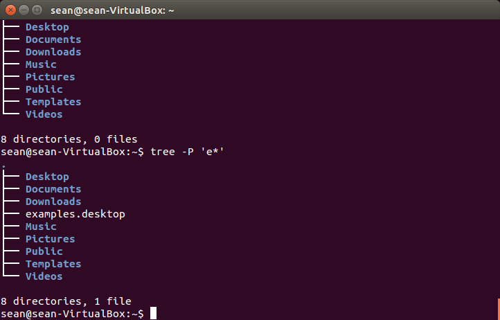
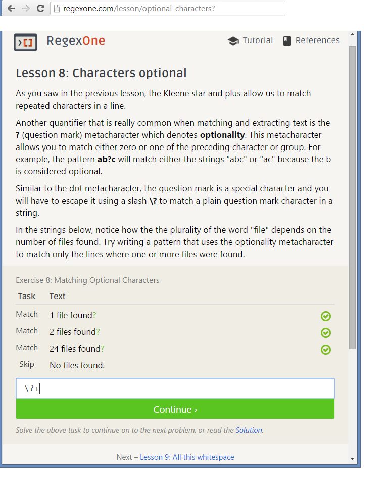
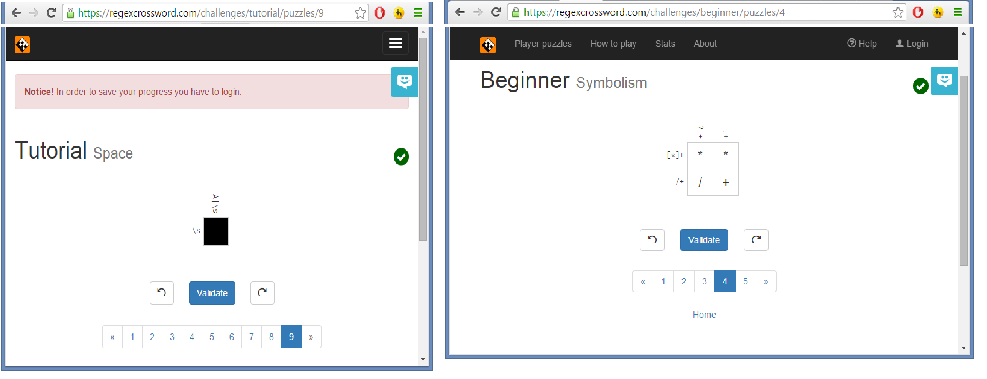

c. Reading assignments - make sure to reflect on these in a lab1.md file in your repository

  1.  Please read the 10 criteria of Open Source Definition http://opensource.org/osd and understand why they are important.
        What I learned from reading "The Open Source Definition":
        The basic idea here is that if you are claiming to distribute "open source software", it really must be free. 
        It must be really free. Free to use, free to redistribute, free to reuse, free to share. No "catches".

  2.  Please read Eric Raymond's article Smart Questions How to ask the question The Smart Way .
  
        What I learned from reading "Smart Questions How to ask the question The Smart Way": 
        It is important to ask questions, we learn from asking good questions. 
        Bad questions do not help us learn. Bad questions look for the "fish" without learning how to "fish".
        Bad questions waste the time of others who mostly volunteer to help answer "good" questions.
        Bad questions are usually lazy, used at the first moment of road block to escape doing your own homework
        
        
        Do you have more suggestions for How To Answer Questions in a Helpful Way (from your past experience) http://www.catb.org/esr/faqs/smart-questions.html#idp64834912
        List at least two.
          1) in addition to listing what you have tried, list what you haven't generally tried but suspect as being a cause but unable to diagnose.
          2) the main goal of answering a question should be to teach the OP how to "fish" in regards to the question asked. answers should follow this model allowing the OP to learn, instead of getting an "answer"
          

3.Install tree and get the directory structure.

sudo apt-get install tree
man tree
Take a screenshot and add to lab1.md:

e. Regex:
  1) 
    
  2) 
    

