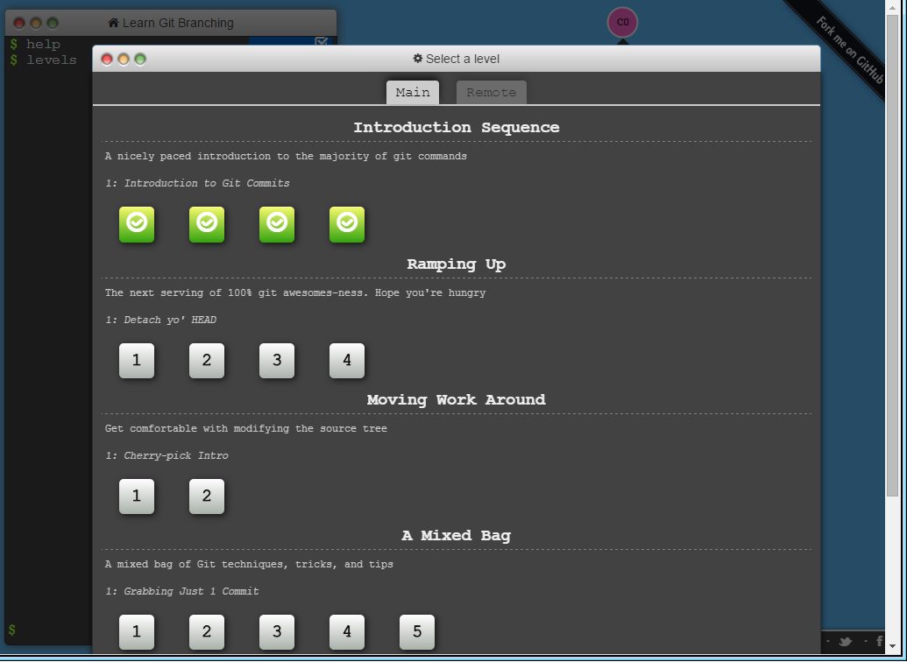

#LAB3#

  

#CourseProject#
  [link here](https://github.com/SeanWaclawik/courseproject.git)

#Story/ Team Table#
  [Repo link here](https://github.com/SeanWaclawik/Story.git)
  [table6.md file](https://github.com/SeanWaclawik/Story/blob/master/Table6/table6.md)
