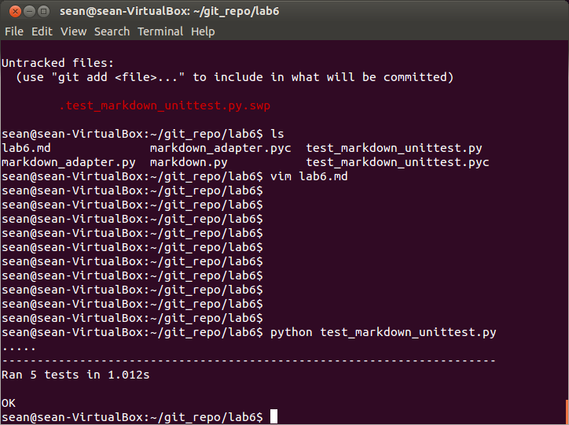

# Lab 6 Community Development and Unit Testing - March 11, 2016

## Part 1 - Community
1. Project selection
  1. Take a look at your five assigned projects from https://rcos.io/projects and clone them locally.
      Table 7: projects 26-30

  2. Look up by hand and record in `labreport6.md`:
    - the number of contributors
    - number of lines of code
      > To get the lines of a project, try something like `git ls-files -z | xargs -0 wc -l` in the cloned project directory

    - the first commit
    - the latest commit
    - the current branches
    
2. Gitstats
  1. Install
    - Clone the project `https://github.com/hoxu/gitstats` locally, and run `make install`
      > Homebrew / Linuxbrew users can use `brew install --HEAD homebrew/head-only/gitstats`

    - Gitstats requires gnuplot. To install, run `sudo apt-get install gnuplot-x11`(or the appropiate command for your platform).
  2. Running
    - From the command line, run `gitstats <path to project1 git repo> <output path>` inside the cloned project directory
    - You can see the output in a browser by typing `file:///<output path>/index.html` in the address bar (use `pwd` from the command line to get the current path  )
    - You may also be able to open it from the command line using `xdg-open <output path>/index.html`, `sensible-browser <output path>/index.html`, or `sensible-browser <output path>/index.html`
    - Repeat this for each of the five projects.
  4. Compare to your results from #1 to these results and comment on your findings.

    > If you are curious, please read and try to understand the [python code for gitstats](https://github.com/hoxu/gitstats/blob/master/gitstats)
    
    >  (Its even better if you suggest some improvements!)

3. Streaming Contribution Visualizations
   - Read the [webpage for gource](http://gource.io/).
   - Download gource using `sudo apt-get install gource` (or `brew install gource`).
   - Go to each of the five cloned repository directories and execute the command
   `gource`
   - You will get a streaming video of the activity in that project.
   - Now, create a youtube video of these projects.
   - Install ffmpeg using `sudo apt-get install ffmpeg` or install avconv using `sudo apt-get install avconv` (or `brew install <package name>`).
   - Execute the following two commands from each of the cloned repositories:
    ```
    gource -1280x720 -o gource.ppm --time-scale 3
    ffmpeg -y -r 60 -f image2pipe -vcodec ppm -i gource.ppm  -vcodec mpeg4 -b 3000k -s hd480 gource.mp4
     ```
    or
    ```
    gource -1280x720 -o gource.ppm --time-scale 3
    avconv -y -r 60 -f image2pipe -vcodec ppm -i gource.ppm  -vcodec mpeg4 -b 3000k -s hd480 gource.mp4
    ```
    or for a more fun gource:
    ```
    gource -1280x720 -o gource.ppm --auto-skip-seconds 1 --max-files 0 --time-scale 3 --camera-mode track --file-idle-time 0 --bloom-multiplier 1.5  -e 0.5 --title "<Project Title>"
    ```

  - Upload your five videos to youtube and provide links. Is there a leader for each of the five projects? Who would you call the leader?

      > Example youtube videos - [Ruby](https://www.youtube.com/watch?v=si-kxnwKvjU) and  [Observatory   (old)](https://www.youtube.com/watch?v=SKArMLw1QY0)  and [CSCI 2961-01 Intro to Open Source](https://youtu.be/-R3-t0oLcpk )


  __Make sure to include screenshots and comments in your lab report.__
  
  
  
  
#[ALL PART 1 HERE](https://github.com/harrij15/Lab6)#
  
  
  
## Part 2
1. Read the tutorial on unit tests from [pythontesting](http://pythontesting.net/framework/unittest/unittest-introduction) 
(you will be using unit test module)
2.  Copy [`markdown.py`](https://github.com/okken/markdown.py/blob/master/markdown.py) and [`test_markdown_unittest.py`](https://github.com/okken/markdown.py/blob/master/test_markdown_unittest.py) [okken/markdown.py](https://github.com/okken/markdown.py) and make sure that you can run them.
3.  Add translations for:  (making sure to wrap the text correctly)
  - `#` => `<h1>` and `</h1>` 
  - `##` => `<h2>` and `</h2>` 
  - `###` => `<h3>` and `</h3>` 
  - `>` => `<blockquote>` and on the next line with no `>` end it with `</blockquote>` 

  > [Some Markdown examples](https://daringfireball.net/projects/markdown/basics) and [the source](https://daringfireball.net/projects/markdown/basics.text)
  >
  > Look under PARAGRAPHS, HEADERS, BLOCKQUOTES for exact input and output
  > 

4. Write unit tests for the three additional constructs you did.
5. Add your code to github, add links to your code and testcode, and show the results in lab6.md

  * [markdown.py](./markdown.py)
  * [test_markdown_unittest.py](./test_markdown_unittest.py)



