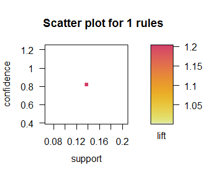
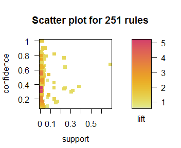
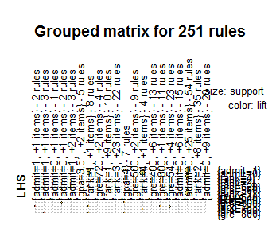
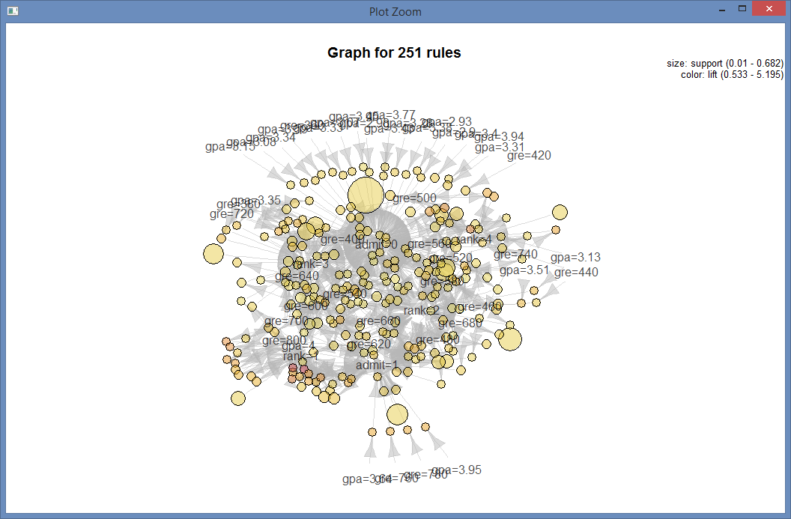

## Lab 8 (4/1/2016) on Statistical Computing/Open Data/Data Science/Machine Learning

Data Science, Statistical Modeling and Machine learning are important, current topics in Computer Science. There has been a lot of open source software and open data available.

[This site](http://www.analyticsvidhya.com/blog/2014/11/data-science-projects-learn/) recommends five projects to try in order to learn data science. Another place to look at is [Kaggle](https://kaggle.com). Kaggle holds competitions on machine learning/data science. A couple of years ago, Diogo, a student in RCOS, won first place in the [cause-effect pairs competition](https://www.kaggle.com/c/cause-effect-pairs/forums/t/5702/code-of-top-ranking-participants/30618) and [his code can be found here](http://rcos.rpi.edu/projects/protoml/). If you are interested in data science you can participate (and maybe even win!).

Here is a smple program with apriori rules https://github.com/rcos/CSCI2963-01/blob/master/Labs/lab8-titanic-example-2015.R using titanic disaster data.

Now back to the Graduate Admissions data:

Graduate Admssions dataset is [available in R](http://www.ats.ucla.edu/stat/data/binary.csv) If you issue a R Command str(admissions) tells you what the columns of this data set contain (namely admit (0 or 1), GRE score, GPA and Rank). There are 400 data points. First you have to convert the numerical entries into class variables) - These two command of R will do that

col_names <- names(admissions)

admissions[,col_names] <- lapply(admissions[,col_names] , factor)

For this lab, please do the following - Lab report should be in your github page

1. Read Chapter 9 of the book on [Association Rule Mining](https://cran.r-project.org/doc/contrib/Zhao_R_and_data_mining.pdf)
(You can also read [these slides](http://www.slideshare.net/rdatamining/association-rule-mining-with-r ))

2. Read about the [background on Association Rule mining](https://en.wikipedia.org/wiki/Association_rule_learning)

    *hint In RStudio, go to Tools -> Install Packages, then type arules into the "Packages" box, hit ok and do the same thing with arulesViz*

3. Implement association rules for Graduate Admissions Data set (experiment with different parameters. Look in chapter 9 of the book on page 89 for support and confidence )

4. Try different visulaizations as done in chapter 9 of the text book. (Things have changed with R too - To load RGraphviz  go to a new Rscript window and type  `source("http://bioconductor.org/biocLite.R")`   Next, type in `biocLite("Rgraphviz")` After this you will be able to plot the graph of rules.)

####

####

####

####

####[code here](https://github.com/SeanWaclawik/open_source/blob/master/lab8/lab8.R)

5. (optional) Read the kaggle [R tutorial on Machine Learning](https://www.datacamp.com/courses/kaggle-tutorial-on-machine-learing-the-sinking-of-the-titanic) (Random forest is also discussed in chapter 4 of the Zhao's book)
(you can login with your facebook or google plus account or register)

6.  Write a paragraph description of the status of your project - What did you do last week on your project? You only have 5 or 6 more weeks to finish your project.

###This week I looked into the tools I would use for my project as well as creating a roadmap of my timeline

   [email alerts for users](http://www.pythonforbeginners.com/code-snippets-source-code/using-python-to-send-email)
   [encryption of user ID/PW](https://pythonhosted.org/passlib/)

   
   Weekly timeline:
   3/28		Analyze in depth work required, feature list, more detailed timeline, packages/libraries required 
   4/4 - 4/18	Core script writing
   4/18 - 4/25	Server side work to schedule runs/ alert users
   5/2		Add additional features/ make more generic / make webpage for project?
   5/9		Final testing / iron out any bugs or issues
   
   this upcoming week I plan on completing the basic functionality of the main automation script

